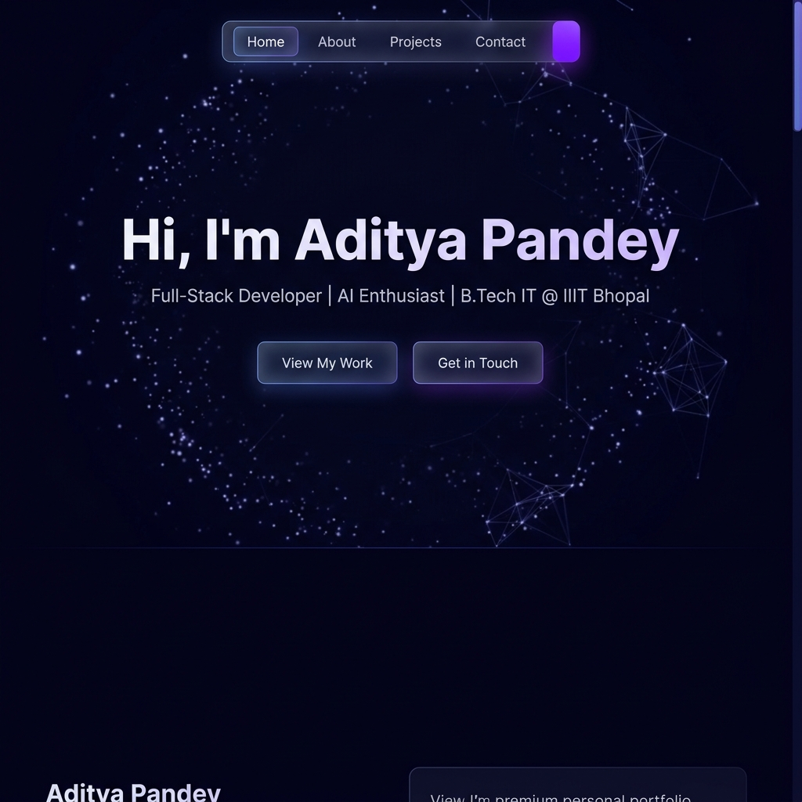
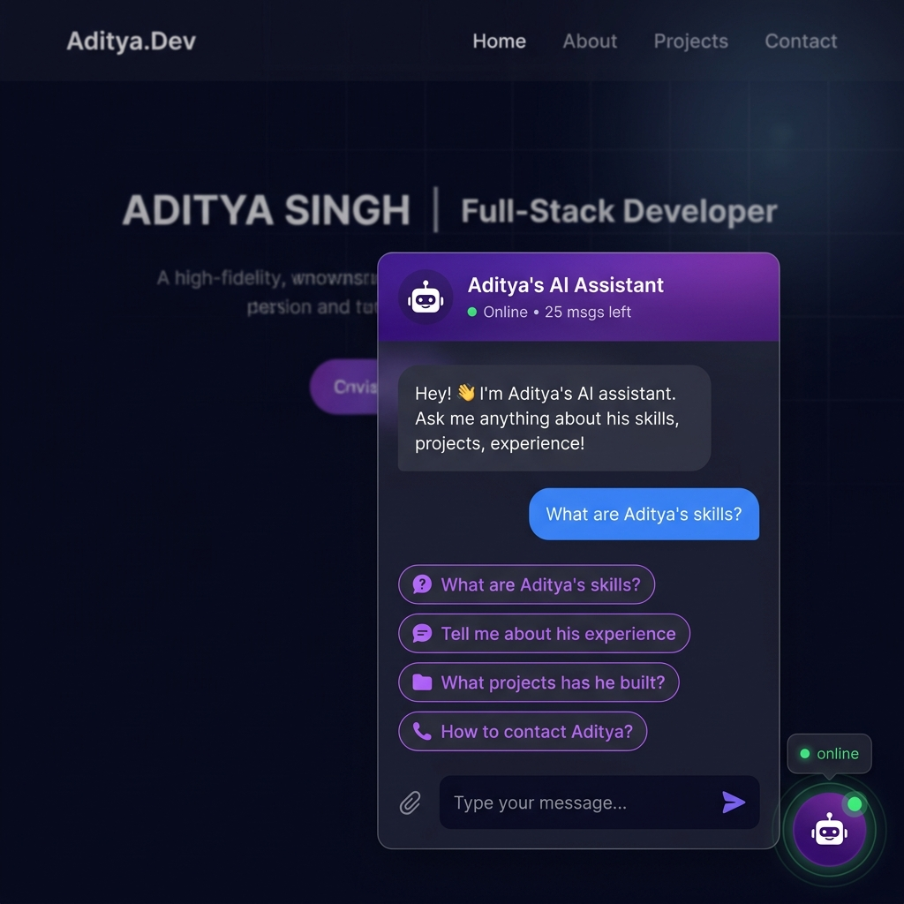
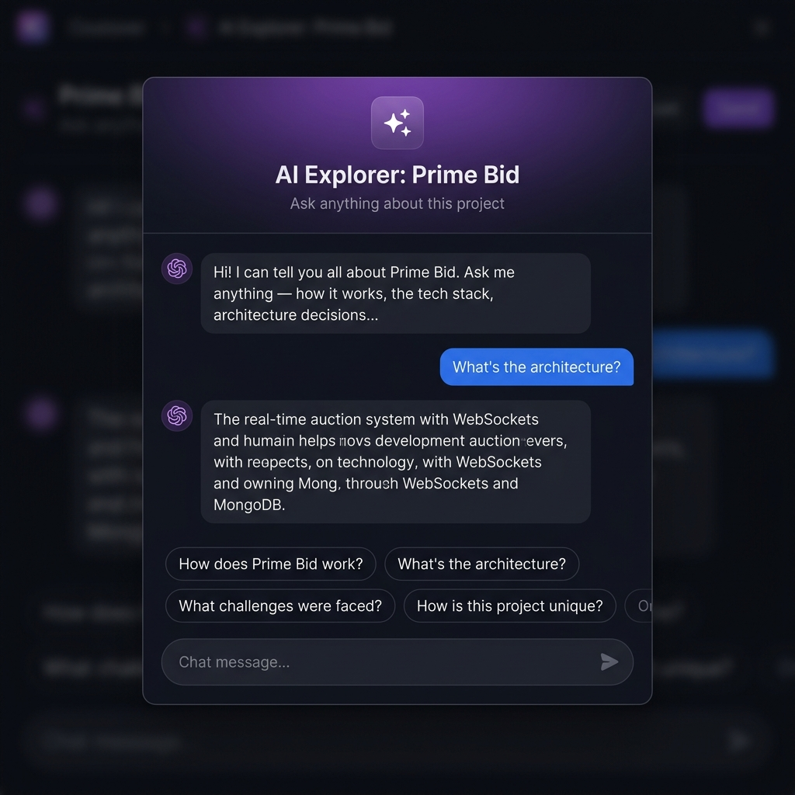
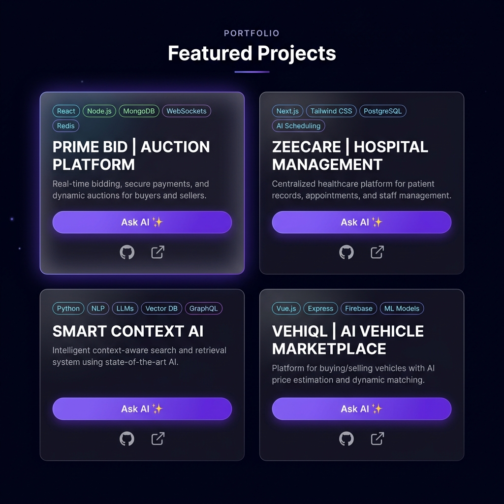

<div align="center">

# ✨ Aditya Pandey — Personal Portfolio

**A blazing-fast, AI-powered personal portfolio built with React 19, Vite, and TailwindCSS 4.**

[](https://aditya-portfolio-pi-nine.vercel.app/)
[](https://react.dev/)
[](https://vitejs.dev/)
[](https://tailwindcss.com/)
[](https://ai.google.dev/)
[](LICENSE)

</div>

---



---

## 🗂️ Table of Contents

- [Overview](#-overview)
- [🤖 AI Features — The Star of the Show](#-ai-features--the-star-of-the-show)
- [✨ All Features](#-all-features)
- [📸 Screenshots](#-screenshots)
- [🛠 Tech Stack](#-tech-stack)
- [📂 Project Structure](#-project-structure)
- [⚙️ Getting Started](#️-getting-started)
- [🔑 Environment Variables](#-environment-variables)
- [📦 Build & Deploy](#-build--deploy)
- [🎨 Customization Guide](#-customization-guide)
- [🤝 Contributing](#-contributing)

---

## 🔍 Overview

This is not just another portfolio — it's a **fully interactive, AI-powered showcase** of Aditya Pandey's work as a Full-Stack Developer and AI enthusiast. Built with the latest React 19 and TailwindCSS 4, it features **two Gemini-powered AI chatbots**, a living animated background network, smooth scroll-triggered animations, and a polished dark-mode aesthetic throughout.

> **Aditya** is a 4th-year B.Tech IT student at IIIT Bhopal, currently interning as a Software Developer at CausalFunnel. AIR 224 in TCS CodeVita, 500+ LeetCode problems solved, and builder of production-grade full-stack applications.

---

## 🤖 AI Features — The Star of the Show

This portfolio integrates **Google Gemini 2.5 Flash** in two unique ways, making it unlike any other portfolio you've seen.

### 1. 💬 AI Assistant Chatbot (Global)

> A floating, always-available AI assistant that knows everything about Aditya.



**How it works:**
- Powered by **Gemini 2.5 Flash** with a rich system prompt containing Aditya's full profile — skills, experience, projects, achievements, and contact info
- A **glowing purple floating button** sits in the bottom-right corner with a pulse animation to grab attention
- Click it to open a **glassmorphism chat panel** with smooth Framer Motion animations
- Features **quick-question chips** for instant one-click queries:
  - *"What are Aditya's skills?"*
  - *"Tell me about his experience"*
  - *"What projects has he built?"*
  - *"How to contact Aditya?"*
- Animated **typing indicator** (bouncing dots) while the AI responds
- **Rate-limited** to 25 messages per session to prevent abuse
- Real-time **"msgs left"** counter in the header
- Handles API errors gracefully with friendly fallback messages

**Key files:**
- [`src/components/AiChat.jsx`](./src/components/AiChat.jsx) — Chat UI with Framer Motion animations
- [`src/utils/gemini.js`](./src/utils/gemini.js) — Gemini API client, rate limiting, and Aditya's context prompt

---

### 2. ✨ Ask AI — Per-Project AI Explorer

> Every project card has an **"Ask AI ✨"** button that opens a context-aware AI modal pre-loaded with that project's details.



**How it works:**
- Each project card has a dedicated **"Ask AI ✨"** button with a sparkle icon
- Clicking it opens a **full-screen backdrop modal** with Framer Motion scale animations
- The AI is instantly briefed with the specific project's title, description, tech stack, GitHub URL, and live demo link
- Pre-loaded **context-aware quick questions** for that project:
  - *"How does [Project] work?"*
  - *"What's the architecture?"*
  - *"What challenges were faced?"*
  - *"How is this project unique?"*
- Same Gemini 2.5 Flash backend, but with an **injected project context** so answers are deeply technical and project-specific
- Shares the same session-level rate limit as the global chatbot

**Key files:**
- [`src/components/AiProjectModal.jsx`](./src/components/AiProjectModal.jsx) — Per-project AI modal
- [`src/components/sections/Projects.jsx`](./src/components/sections/Projects.jsx) — Project cards with "Ask AI" integration

---

## ✨ All Features

| Feature | Description |
|---|---|
| 🤖 **Global AI Chatbot** | Floating Gemini-powered assistant that knows Aditya's full profile |
| ✨ **Per-Project Ask AI** | Context-aware AI modal on every project card |
| 🌐 **Animated Network Background** | Canvas-based particle network animation on the hero section |
| 🎞️ **Scroll Animations** | Sections animate in on scroll with `RevealOnScroll` + Framer Motion |
| 📱 **Fully Responsive** | Mobile-first layout with a smooth hamburger menu |
| 📧 **Contact Form** | Working email form via EmailJS — no backend required |
| ⚡ **Vite 6** | Sub-second HMR and blazing fast production builds |
| 🎨 **Glassmorphism UI** | Dark mode with `backdrop-blur`, gradient borders, and glow effects |
| 🌙 **Consistent Dark Theme** | Deep `#030014` background with indigo/purple accent palette |
| 🏃 **Loading Screen** | Branded loading animation on first visit |

---

## 📸 Screenshots

### Hero Section


### Projects Grid


### AI Assistant Chatbot


### Per-Project AI Explorer


---

## 🛠 Tech Stack

### Core
| Technology | Version | Purpose |
|---|---|---|
| **React** | 19 | Component-based UI library |
| **Vite** | 6 | Build tool with lightning-fast HMR |
| **TailwindCSS** | 4 | Utility-first styling |
| **Framer Motion** | 12 | Animations and transitions |

### AI & Integrations
| Technology | Purpose |
|---|---|
| **Google Gemini 2.5 Flash** (`@google/genai`) | AI chatbot and per-project Q&A |
| **EmailJS** | Contact form email delivery (no backend) |
| **Lucide React** | Icon library |
| **React Icons** | Extended icon set |

### DevOps & Deployment
| Tool | Purpose |
|---|---|
| **Vercel** | Primary deployment (live demo) |
| **GitHub Pages** | Secondary deployment via `gh-pages` |
| **ESLint** | Code quality and linting |

---

## 📂 Project Structure

```
aditya-portfolio/
├── public/
│   ├── screenshots/          # README preview images
│   └── index.html
├── src/
│   ├── components/
│   │   ├── AiChat.jsx            # 🤖 Global AI Assistant chatbot
│   │   ├── AiProjectModal.jsx    # ✨ Per-project Ask AI modal
│   │   ├── BackgroundNetwork.jsx # 🌐 Animated canvas network
│   │   ├── Footer.jsx
│   │   ├── LoadingScreen.jsx     # 🏃 Branded loading screen
│   │   ├── MobileMenu.jsx        # 📱 Hamburger menu
│   │   ├── Navbar.jsx
│   │   ├── RevealOnScroll.jsx    # 🎞️ Scroll animation wrapper
│   │   └── sections/
│   │       ├── About.jsx         # Skills & education
│   │       ├── Contact.jsx       # EmailJS contact form
│   │       ├── Experience.jsx    # Work experience timeline
│   │       ├── Home.jsx          # Hero section
│   │       └── Projects.jsx      # Project cards + Ask AI
│   ├── utils/
│   │   └── gemini.js             # Gemini API client + rate limiting
│   ├── App.jsx
│   ├── index.css                 # Tailwind base + global styles
│   └── main.jsx
├── .env                          # API keys (not committed)
├── .gitignore
├── package.json
├── vite.config.js
└── README.md
```

---

## ⚙️ Getting Started

### Prerequisites
- **Node.js** ≥ 18
- A **Google Gemini API key** — get one free at [aistudio.google.com](https://aistudio.google.com/)
- An **EmailJS** account for the contact form (optional)

### 1. Clone the Repository

```sh
git clone https://github.com/addy0328p/aditya-portfolio.git
cd aditya-portfolio
```

### 2. Install Dependencies

```sh
npm install
```

### 3. Configure Environment Variables

```sh
cp .env.example .env
```

Fill in your keys (see [Environment Variables](#-environment-variables) below).

### 4. Start the Development Server

```sh
npm run dev
```

Open [http://localhost:5173](http://localhost:5173) in your browser.

---

## 🔑 Environment Variables

Create a `.env` file in the project root with the following keys:

```env
# Google Gemini API Key — powers both AI chatbots
VITE_GEMINI_API_KEY=your_gemini_api_key_here

# EmailJS — for the contact form
VITE_EMAILJS_SERVICE_ID=your_service_id
VITE_EMAILJS_TEMPLATE_ID=your_template_id
VITE_EMAILJS_PUBLIC_KEY=your_public_key
```

> **⚠️ Never commit your `.env` file.** It's already in `.gitignore`.

| Variable | Where to get it |
|---|---|
| `VITE_GEMINI_API_KEY` | [Google AI Studio](https://aistudio.google.com/app/apikey) |
| `VITE_EMAILJS_*` | [EmailJS Dashboard](https://www.emailjs.com/) |

---

## 📦 Build & Deploy

### Production Build

```sh
npm run build
```

### Preview Production Build Locally

```sh
npm run preview
```

### Deploy to GitHub Pages

```sh
npm run deploy
```

> This runs `predeploy` (which builds) then `gh-pages -d dist` automatically.

### Deploy to Vercel

```sh
# Install Vercel CLI
npm i -g vercel

# Deploy
vercel
```

Set your environment variables in the Vercel dashboard under **Project → Settings → Environment Variables**.

---

## 🎨 Customization Guide

### Update Your Personal Info
Edit the `ADITYA_CONTEXT` string in [`src/utils/gemini.js`](./src/utils/gemini.js) to replace Aditya's details with your own. This is what the AI chatbots use to answer questions about you.

### Update Projects
Edit the `projects` array in [`src/components/sections/Projects.jsx`](./src/components/sections/Projects.jsx). Each project object supports:

```js
{
  title: "Project Name | Tagline",
  desc: [/* JSX description elements */],
  tech: ["React", "Node.js", "MongoDB"],
  link: "https://github.com/...",   // GitHub URL
  live: "https://...",              // Live demo URL
}
```

The **"Ask AI ✨"** button on each card is generated automatically.

### Change the Color Palette
The portfolio uses a purple/indigo palette (`#6366f1` → `#a855f7`). To change it, search for these hex values across the `src/` directory and replace them with your preferred colors.

### Adjust AI Rate Limit
In [`src/utils/gemini.js`](./src/utils/gemini.js), change:
```js
const MAX_MESSAGES_PER_SESSION = 25; // Increase or decrease as needed
```

---

## 🤝 Contributing

Contributions, issues, and feature requests are welcome!

1. Fork the repository
2. Create your feature branch: `git checkout -b feature/amazing-feature`
3. Commit your changes: `git commit -m 'Add amazing feature'`
4. Push to the branch: `git push origin feature/amazing-feature`
5. Open a Pull Request

---

<div align="center">

**Built with ❤️ by [Aditya Pandey](https://aditya-portfolio-pi-nine.vercel.app/)**

[](https://github.com/addy0328p)
[](https://linkedin.com/in/aditya-p01/)
[](mailto:aditya12bone@gmail.com)

⭐ **Star this repo if you found it helpful!**

</div>
